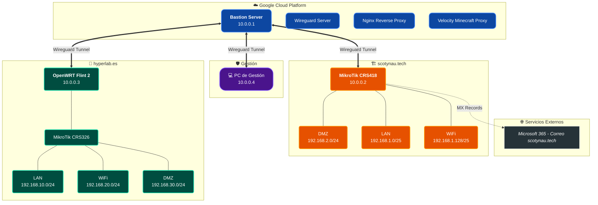

# Network Infrastructure - scotynau.tech & hyperlab.es

Este repositorio documenta la arquitectura de red híbrida (GCP + Multi-site) que interconecta los servicios de scotynau.tech y hyperlab.es.

## Topología de Red

A continuación se muestra el diagrama de la infraestructura utilizando Mermaid.js.

## Detalles de Segmentación

### scotynau.tech (MikroTik CRS418)
- **Túnel VPN:** 10.0.0.2 (Wireguard)
- **DMZ:** 192.168.2.0/24
- **LAN:** 192.168.1.0/25
- **WiFi:** 192.168.1.128/25
- **Correo:** Microsoft 365 (Business Standard/Basic)

### hyperlab.es (OpenWRT)
- **Túnel VPN:** 10.0.0.3 (Wireguard)
- **LAN:** 192.168.10.0/24
- **WiFi:** 192.168.20.0/24
- **DMZ:** 192.168.30.0/24

### Gestión
- **Admin PC:** 10.0.0.4 (Túnel directo Wireguard)
